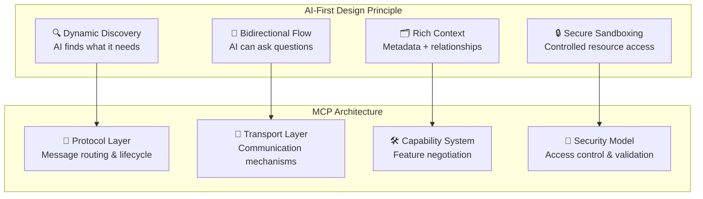
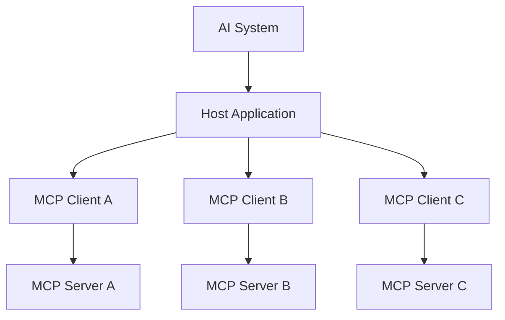
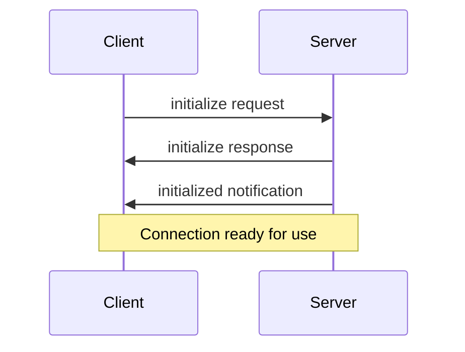

# MCP AI Integration Platform: Корпоративний каркас автоматизації Power BI

## Мета та цінність
Даний проект — стратегічна платформа для автоматизації повного циклу розробки, підтримки, стандартизації та валідації Power BI звітів і супутніх артефактів (PBIP, M-код, DAX, SQL). Рішення орієнтоване на підвищення ефективності бізнесу, зниження операційних ризиків, забезпечення прозорості та якості даних у корпоративному середовищі.

---

## Архітектура Model Context Protocol (MCP)


Model Context Protocol (MCP) — відкритий стандарт для інтеграції, автоматизації та управління моделями даних у BI/аналітичних системах. MCP забезпечує AI-First підхід, асинхронну взаємодію, гнучку маршрутизацію повідомлень та безпечний доступ до ресурсів.


### AI-First Design Principle (загальна логіка MCP)

<!-- AI-First Design Principle: Відображає ключові принципи, які лежать в основі MCP — динамічне виявлення, двосторонній обмін, багатий контекст, контрольований доступ. MCP Architecture: Показує відповідність принципів до архітектурних шарів протоколу. -->

> Діаграма показує, як AI-First принципи пов'язуються з архітектурними шарами MCP.

### Взаємодія компонентів MCP (інтеграція AI, клієнтів і серверів)

<!-- Взаємодія компонентів MCP: AI-система через хост-додаток отримує доступ до різних типів ресурсів через клієнти MCP, які підключаються до відповідних серверів. -->

> Діаграма ілюструє, як AI-система через хост-додаток взаємодіє з різними MCP-клієнтами та серверами.

### Сесійна асинхронна взаємодія (обмін повідомленнями)

<!-- Сесійна асинхронна взаємодія: Клієнт ініціює запит, сервер відповідає, надсилає нотифікацію — після цього з'єднання готове до роботи. -->

> Діаграма показує типовий асинхронний обмін між клієнтом і сервером MCP.


#### Важливо: асинхронна взаємодія
MCP підтримує асинхронний обмін повідомленнями (requests/notifications), що дозволяє ефективно працювати з різними джерелами та сервісами без блокування процесів.

```python
class Session(BaseSession[RequestT, NotificationT, ResultT]):
	async def send_request(self, request: RequestT, result_type: type[Result]) -> Result:
		"""Send request and wait for response. Raises McpError if response contains error."""
		# Request handling implementation

	async def send_notification(self, notification: NotificationT) -> None:
		"""Send one-way notification that doesn't expect response."""
		# Notification handling implementation

	async def _received_request(self, responder: RequestResponder[ReceiveRequestT, ResultT]) -> None:
		"""Handle incoming request from other side."""
		# Request handling implementation

	async def _received_notification(self, notification: ReceiveNotificationT) -> None:
		"""Handle incoming notification from other side."""
		# Notification handling implementation
```

### Ключові переваги автоматизації
- **Скорочення часу на рев’ю та деплой:** у 5-10 разів швидше порівняно з ручними, не стандартизованими процесами
- **Зниження кількості помилок та інцидентів:** на 80-95% завдяки автоматичній валідації та стандартизації
- **Прозорий аудит змін:** контроль версій, rollback, централізований журнал змін
- **Автоматична стандартизація:** lint, naming, структура, відповідність корпоративним політикам
- **Централізоване зберігання артефактів:** легкий пошук, аналіз, відсутність дублювання та втрат
- **Безпечний доступ до метаданих:** ізоляція паролів, read-only доступ, мінімізація ризиків
- **Можливість CI/CD:** автоматичний деплой, тестування, інтеграція з корпоративними системами

### Втрати та ризики ручного підходу
- Витрати часу на пошук, копіювання, рев’ю — до 50-70% часу розробника
- Високий ризик втрати, перезапису, неактуальних артефактів
- Відсутність централізованих стандартів, складність підтримки та масштабування
- Всі зміни — вручну, без автоматичного аудиту
- Складна інтеграція з іншими системами, низька прозорість процесу

---


# Опис MCP AI Integration Layers

## MCP Server (серверна частина)
**mcp_server/** — окремий модуль для серверної логіки, інтеграції, оркестрації, безпеки та роботи зі стандартами.

### Структура:
```
mcp_server/
	main.py            # точка входу FastAPI MCP server
	config.py          # конфігурація, параметри безпеки
	api.py             # ендпоінти для інтеграції, рев'ю, стандартизації
	security.py        # механізми авторизації, secrets management
	orchestration.py   # workflow для рев'ю, деплою, моніторингу
	standards/         # робота зі стандартами MCP
	tests/             # unit-тести
```
**Призначення:** ізоляція бізнес-логіки, інтеграції, безпеки, масштабування та CI/CD.
**Інтеграція:** взаємодія з PBIP, external standards, DataGovernance, CI/CD pipeline.

## External Standards & Templates
**Power_Query_guide:**
- M-Code formatting, naming, header comments, doc-blocks, best practices для Power Query/Fabric/Power BI
- Джерело: external/Power_Query_guide/Standards/FORMATTER.md
**DAX_Templates:**
- Naming, display folders, coding standards, performance rules, anti-patterns для DAX
- Джерело: external/DAX_Templates/Standards/02_DAX_Standards_and_Naming.md

Всі стандарти структуровано у external/standards_mcp.json для автоматичної обробки MCP.

## 1. Валідація MS SQL даних, схем та процедур

### Деталізація
- Доступ лише до метаданих та статистик (без даних)
- MCP Data Connector: read-only, secrets management
- Витяг INFORMATION_SCHEMA, sys.tables, sys.indexes, статистики
- Перевірка naming, presence of keys, структури
- Аудит змін у схемах, впливу на статистики
- Логування та звіти у CSV

**Безпека:** мінімізація ризиків, read-only доступ, ізоляція паролів
**Вплив:** підвищення якості моделі, швидке реагування на зміни
**Альтернатива:** snapshot metadata, periodic export, audit logs


## 2. Рев’ю PBIP та деплой/редеплой

### Enterprise деплой (автоматизація)
- Автоматичний деплой PBIX у Power BI Service через REST API (див. pbip_artifacts/deploy_enterprise.py)
- Інтеграція з CI/CD pipeline (Azure DevOps, GitHub Actions)
- MCP може керувати рев'ю, lint, стандартизацією, деплоєм
- TODO: Реалізувати deploy_enterprise.py для автоматизації

### Деталізація
- PBIP staging workspace, рев’ю через pull request
- Автоматичний аналіз структури PBIP (модель, міри, зв’язки)
- Збереження у TMDL, JSON, YAML
- Порівняння зі стандартами MCP
- Генерація звітів відповідності, lint/warnings/errors
- Автоматичний деплой після успішного рев’ю
- Аудит змін, rollback, контроль версій

**Безпека:** контроль доступу, централізований аудит, CI/CD
**Вплив:** зниження помилок, швидке рев’ю, прозорість процесу
**Альтернатива:** ручний деплой, SharePoint, email approval


## 3. Моніторинг усіх прошарків

### Деталізація
- MCP Monitoring API, централізований збір логів
- Алерти, health checks, audit trail
- Візуалізація статусу (dashboard)
- Інтеграція з Prometheus, Grafana, ELK

**Безпека:** ізоляція логів, обмеження доступу, secure storage
**Вплив:** швидке реагування, стабільність, аудит
**Альтернатива:** зовнішні сервіси, окремі audit-репорти


## 4. Fabric та зовнішні дані (API, Excel, CSV)

### Деталізація
- Модулі для парсингу та інтеграції даних з Excel, CSV, API (REST, SOAP)
- Автоматичне визначення структури, типів даних, валідація відповідності стандартам MCP
- Збереження метаданих у TMDL, JSON, YAML для подальшої обробки
- Логування імпортів, аудит змін, quarantine для підозрілих даних
- Sandbox для тестування інтеграції без впливу на продуктивне середовище

**Безпека:** парсинг лише дозволених джерел, quarantine imports, контроль доступу до API
**Вплив:** підвищення якості інтеграції, зниження ризиків, автоматизація імпорту
**Альтернатива:** ручний імпорт, попередня перевірка вручну, окремі скрипти

## 5. Fabric Pipelines, ефективність та наскрізний моніторинг

### Деталізація
- Інтеграція з Fabric Pipelines для автоматизації ETL, деплою, оновлення моделей
- Впровадження наскрізного моніторингу всіх прошарків (від джерела до звіту)
- Збір метрик, логів, статусів на кожному етапі pipeline
- Автоматичний аналіз ефективності, пропозиції щодо оптимізації (наприклад, рекомендації по індексам, структурам, розподілу навантаження)
- Візуалізація всіх етапів pipeline, алерти, audit trail
- Можливість інтеграції з корпоративними системами моніторингу та аналітики

**Безпека:** контроль доступу до pipeline, ізоляція конфігурацій, аудит змін
**Вплив:** підвищення ефективності, зниження простоїв, оптимізація ресурсів
**Альтернатива:** ручне адміністрування pipeline, окремі скрипти для моніторингу

## 6. DataGovernance: корпоративне управління даними

### Деталізація
- Впровадження політик доступу, якості, безпеки та відповідності даних
- Централізований контроль метаданих, lineage, ownership
- Автоматичний аудит змін, версій, доступу
- Валідація відповідності корпоративним та регуляторним стандартам
- Візуалізація структури даних, зв’язків, впливу змін
- Інтеграція з DataGovernance платформами (Purview, Collibra, Informatica)

**Безпека:** контроль доступу, аудит, відповідність політикам
**Вплив:** підвищення довіри до даних, прозорість, зниження ризиків
**Альтернатива:** ручне ведення каталогів, розрізнені Excel/SharePoint-реєстри

---

## Формат session_id та принципи сесій MCP

- Кожна сесія має унікальний ідентифікатор `session_id` (UUID v4), який генерується сервером при старті сесії.
- `session_id` передається у всіх запитах/відповідях через HTTP-заголовок `X-Session-ID`.
- Формат: `xxxxxxxx-xxxx-xxxx-xxxx-xxxxxxxxxxxx` (наприклад, `d3b07384-2e4e-4c3a-9c1e-1a2b3c4d5e6f`)
- Всі дії, пов'язані із сесією, логуються для аудиту та трасування.
- Приклад старту сесії:

```http
POST /session/start
Response: { "session_id": "d3b07384-2e4e-4c3a-9c1e-1a2b3c4d5e6f", "status": "started" }
```

- Приклад запиту з session_id:

```http
POST /process
X-Session-ID: d3b07384-2e4e-4c3a-9c1e-1a2b3c4d5e6f
{ ...payload... }
```

---

## Async workflow: callback, polling, опис

- Асинхронні задачі можуть запускатися через ендпоінти `/async-task`, `/async-task-callback`, `/async-task-polling`.
- Для callback (webhook) клієнт передає заголовок `X-Callback-URL`, сервер викликає цей URL після завершення задачі.
- Для polling сервер зберігає статус задачі, клієнт періодично опитує `/async-task-status`.
- Всі async запити мають session_id у заголовку `X-Session-ID`.

### Приклад callback:
```http
POST /async-task-callback
X-Session-ID: <session_id>
X-Callback-URL: https://client/callback
{ ...payload... }
```

### Приклад polling:
```http
POST /async-task-polling
X-Session-ID: <session_id>
{ ...payload... }

GET /async-task-status
X-Session-ID: <session_id>
```

---

## Session Lifecycle та Audit Trail MCP

- Кожна сесія проходить етапи: старт (init), обробка запитів (process), завершення (close).
- Для кожної дії у сесії створюється запис у audit trail з такими полями:
  - `timestamp`: час події (Unix time)
  - `session_id`: ідентифікатор сесії (UUID)
  - `user`: користувач або сервіс
  - `action`: тип дії (init, process, close, ...)
  - `status`: статус виконання (started, ok, error, closed)
- Audit trail зберігається централізовано (in-memory, файл, БД) та може експортуватися для аналізу.
- Приклад запису:

```json
{
  "timestamp": 1701024000.0,
  "session_id": "d3b07384-2e4e-4c3a-9c1e-1a2b3c4d5e6f",
  "user": "service",
  "action": "init",
  "status": "started"
}
```

- Для отримання історії дій по сесії використовуйте метод `get_session_records(session_id)`.
- Для експорту всієї історії — метод `export()`.

---

## Capabilities MCP: типи ресурсів та структура

- Основні типи ресурсів:
  - PBIP (Power BI Project)
  - DAX (Data Analysis Expressions)
  - M-код (Power Query)
  - SQL (MS SQL, external SQL)
  - External data (Excel, CSV, API)

- Структура capability:
```json
{
  "resource": "PBIP",
  "actions": ["review", "validate", "deploy", "export"],
  "formats": ["TMDL", "JSON", "YAML"]
}
```

- Кожен тип ресурсу має перелік доступних дій та форматів.
- Для отримання списку можливостей буде реалізовано ендпоінт `/capabilities`.

---

## Формат метаданих MCP

- Кожна модель має унікальний `model_id` (рядок, UUID або slug).
- Метадані моделі містять:
  - `name`: назва моделі
  - `version`: версія (рядок, наприклад "v1.0")
  - `description`: опис
  - `resources`: перелік ресурсів (PBIP, DAX, M-код, SQL, external data)
  - `structure`: структура моделі (схеми, таблиці, міри, зв'язки, параметри)
  - `created_at`, `updated_at`: дати створення/оновлення
  - `owner`: відповідальний користувач/сервіс

- Приклад метаданих:
```json
{
  "model_id": "pbip-2025-001",
  "metadata": {
    "name": "Sales Analytics",
    "version": "v1.0",
    "description": "Модель для аналізу продажів",
    "resources": ["PBIP", "DAX", "SQL"],
    "structure": {
      "tables": ["Sales", "Customers", "Products"],
      "measures": ["Total Sales", "Average Price"],
      "relations": [{"from": "Sales", "to": "Customers", "type": "many-to-one"}]
    },
    "created_at": "2025-11-26T10:00:00Z",
    "updated_at": "2025-11-26T12:00:00Z",
    "owner": "bi-team"
  }
}
```

- Формат відповіді ендпоінта `/metadata/sync`:
```json
{
  "model_id": "pbip-2025-001",
  "metadata": { ... },
  "status": "synced"
}
```

---

### MCP Server: базові ендпоінти
- Реалізовано ендпоінти /integration, /review, /standardize, /monitoring (FastAPI)
- Додано stub-логіку для payload/response
- Додано unit-тести для всіх базових ендпоінтів

### MS SQL Validation Layer
- Налаштовано MCP Data Connector для доступу до INFORMATION_SCHEMA, sys.tables, sys.indexes
- Вказано параметри підключення (тільки для метаданих)
